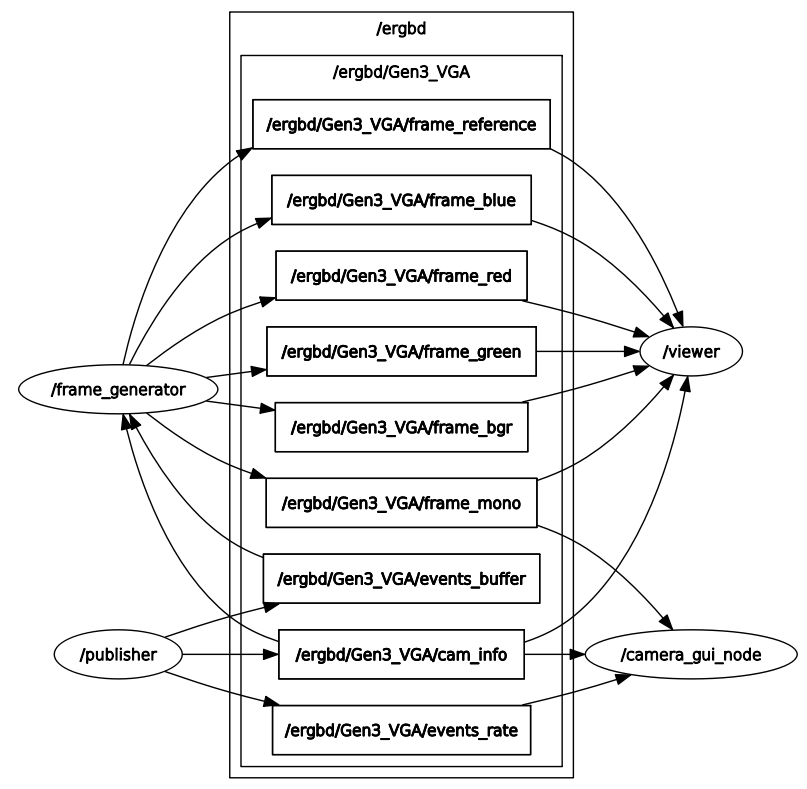
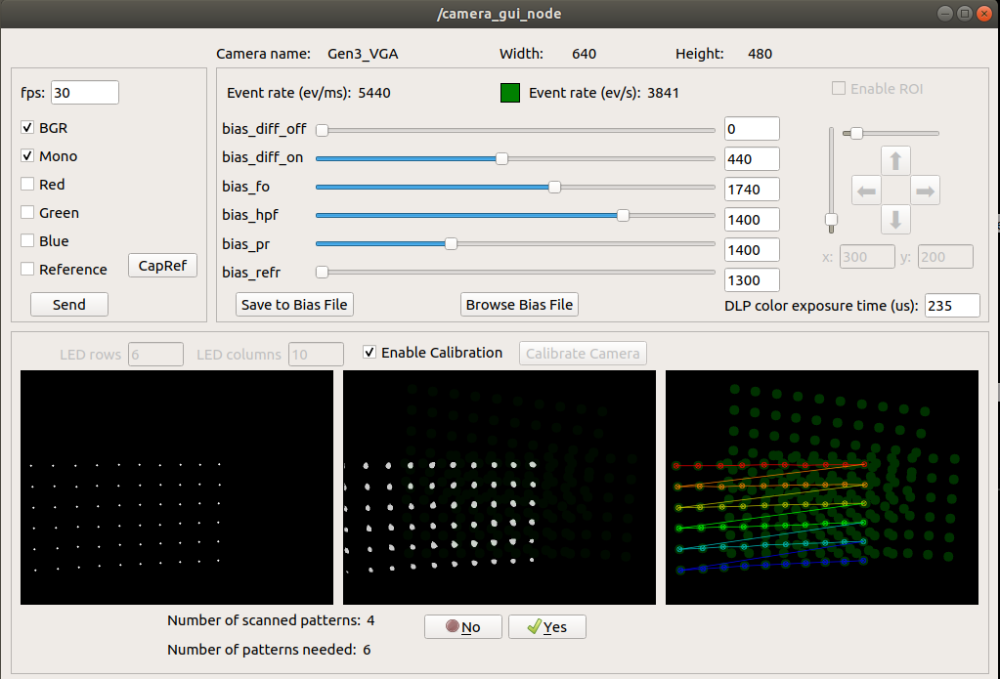
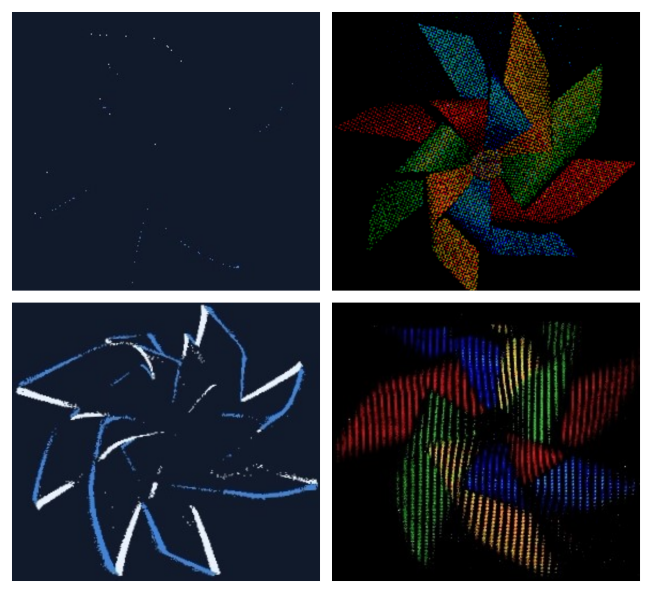

# Event-based RGBD ROS Wrapper

If you reuse parts of this work, please cite the [paper](https://openaccess.thecvf.com/content/WACV2023/html/Bajestani_Event-Based_RGB_Sensing_With_Structured_Light_WACV_2023_paper.html):
```
Seyed Ehsan Marjani Bajestani and Giovanni Beltrame. "Event-based RGB sensing with structured light." Proceedings of the IEEE/CVF Winter Conference on Applications of Computer Vision. 2023.
```

BibTex:
```
@InProceedings{Bajestani_2023_WACV,
 author = {Bajestani, Seyed Ehsan Marjani and Beltrame, Giovanni},
 title = {Event-Based RGB Sensing With Structured Light},
 booktitle = {Proceedings of the IEEE/CVF Winter Conference on Applications of Computer Vision (WACV)},
 month = {January},
 year = {2023},
 pages = {5458-5467},
 organization={IEEE},
 url={https://openaccess.thecvf.com/content/WACV2023/html/Bajestani_Event-Based_RGB_Sensing_With_Structured_Light_WACV_2023_paper.html}
 }
```

This metapackage is similar to [Prophesee ROS wrapper](https://github.com/prophesee-ai/prophesee_ros_wrapper.git). However, it is able to control the camera setting online and publish a **stream of color-stamped events** in addition to RGB frames on ROS topics. The GUI is to calibrate the camera with a Symmetric Circles Grid LED Pattern.

The following packages and nodes are provided:
  * event_based_rgbd_ros_driver - ROS driver, including
    * publisher - publishing color-stamped events from Prophesee sensor aided by the DLP projector on ROS topics
    * frame_generator - listening data from ROS topics, generating frames, and publishing them on ROS topics
    * viewer - listening data from ROS topics, visualizing frames
    * camera_gui_node - showing the camera parameters control them by services, control the publishing frames, and calibrating the camera

  * event_based_rgbd_ros_msgs - messages:
    * Event - contains a color-stamped event from a Prophesee camera aided by the DLP projector (uint16 x, uint16 y, ros::Time ts, bool polarity, uint8 lightColor)
    * EventArray - contains a buffer of events (Event[] events)
    * DLPColor - contains DLP color LED currents (uint8 red_current, uint8 green_current, uint8 blue_current, uint8 color)
    * DLPFrequency - contains DLP pattern frequency parameters (uint16 exposure, uint16 period)

  * event_based_rgbd_ros_srv - service:
    * ChangeAccTime - to change the frame generation/publishing speed in frame_generator (request: uint16 input_display_acc_time, response: uint8 result)
    * ChangeBiases - to change the camera setting (bias) parameters in publisher (request: string bias_name, uint16 bias_value, response: uint8 result)
    * ChangeExposure - to change the expected exposure time for DLP patterns in publisher (request: uint16 exposure_time, response: uint8 result)
    * ChangePublishTopics - to change the publishing frames in frame_generator (request: uint8 publish_topics, response: uint8 result)
    * ChangeRefFlag - to capture a reference frame in frame_generator (request: uint8 capture_ref, response: uint8 result)
    * ChangeROI - to define/active/disabled the region of interest rectangular in publisher (request: uint16 width, uint16 height, uint16 x, uint16 y, uint8 status, response: uint8 result)

Supported cameras:
  * EVK Gen3
  * other cameras supported by [OpenEB](https://github.com/prophesee-ai/openeb)

## Requirements

  * Ubuntu 20.04 or 18.04
  * ROS Noetic or ROS Melodic
  * [OpenEB](https://github.com/prophesee-ai/openeb) - starting from v2.2.0
  * OpenCV 3.2
  * QT (for GUI)

## Installation

First of all, retrieve and compile [OpenEB](https://github.com/prophesee-ai/openeb).

Then, compile the wrapper code:

  * Clone the source code to your catkin workspace ([create a workspace](http://wiki.ros.org/catkin/Tutorials/create_a_workspace), if needed)

  * Compile

    ```
        catkin build
    ```

  * Source the workspace

    ```
        source ~/catkin_ws/devel/setup.bash
    ```
  
## Getting Started
  
### Publishing data from a live camera-projector and listening them 

The DLP projector should be on and projecting patterns in three light colors of red, green, and blue. The default exposure (and period) time is 235 us for red and green and 239 us for blue.

To run all nodes alongside the GUI:

  ```
        roslaunch event_based_rgbd_ros_driver camera-projector.launch
  ```

Instead of running all packages alongside GUI, it is possible to publish data from camera-projector to ROS topics:

  ```
        roslaunch event_based_rgbd_ros_driver publisher.launch
  ```

The following topics will be published:
  * /ergbd/Gen3_VGA/camera_info - info about the camera
  * /ergbd/Gen3_VGA/events_buffer - buffer of color-stamped events
  * /ergbd/Gen3_VGA/events_rate - event rate (per ms)

To listen the publisher node, generate frames, and publishing them on ROS topics:

  ```
        roslaunch event_based_rgbd_ros_driver frame_generator.launch
  ```

To listen the frame_generator node and visualize generated frames:

  ```
        roslaunch event_based_rgbd_ros_driver viewer.launch
  ```

### Recording data from a live camera-projector to rosbag

To record data from live camera to rosbag:
  * Start the publisher:

  ```
        roslaunch event_based_rgbd_ros_driver publisher.launch
  ```

  * Start rosbag recording (choose the topics to record or record all available topics):

  ```
        rosbag record -a
  ```
The graph node, GUI window, and an RGB frame captured by a monochrome event-based camera are shown below.







